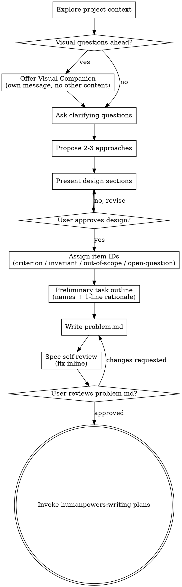

## Stance

- **Refuse vague answers.** "5 results" -> "exactly 5 or >=5?"
- **Push for specifics.** "fast" -> "ms? seconds? quantify."
- **Narrow scope.** "homeshop site" -> "pick one core value."
- **Block nodding agreement.** The developer must articulate, not approve agent drafts.
- **One question at a time.** Bulk dump = banned.

The developer may resist. Persist. Specifics force articulation. Articulation prevents drift.

# Brainstorming Ideas Into Designs

Help turn ideas into a problem definition through natural collaborative dialogue. This skill produces `problem.md` only — task structure (with item IDs) is the next skill's job (`humanpowers:writing-plans`).

Start by understanding the current project context, then ask questions one at a time to refine the idea. Once you understand what you're building, present the problem definition and get user approval.

<HARD-GATE>
Do NOT invoke any implementation skill, write any code, or take an implementation action until you have presented `problem.md` and the user has approved it. This applies to EVERY project regardless of perceived simplicity.
</HARD-GATE>

## Personal learnings

Before starting, read `~/.humanpowers/learnings/brainstorming.md` if it exists. Accumulated guidelines from past projects — medium-trust context for problem decomposition and invariant formulation.

## humanpowers context

When invoked by `humanpowers:humanpowers` (the dispatcher), the workspace `.humanpowers/state.json` exists with `phase = ""`. The brainstorm output is `problem.md`, located at `<workspace>/.humanpowers/problem.md`. Use the template at `references/templates/problem.md`.

`problem.md` items receive stable IDs: `criterion-N`, `invariant-N`, `out-of-scope-N`, `open-question-N`. Downstream artifacts (`tasks.md`, the per-task quiz, plans, the ADR digest) cite these IDs, so once an ID is assigned, do not change it — append new IDs instead.

**Phase transition:** After the developer signs off on `problem.md`, run:

```bash
WS="$(dirname "$(find . -maxdepth 3 -name state.json -path '*/.humanpowers/*' | head -1)")"
WS="$(dirname "$WS")"
bash scripts/update-state.sh "$WS" phase problem-defined
```

Then hand off to `humanpowers:writing-plans`. The flow is brainstorm -> writing-plans -> quiz -> operate. Writing-plans expands the preliminary task outline in `problem.md` into `tasks.md` with full per-task item IDs; the quiz then cites those IDs without inventing new ones.

## Anti-Pattern: "This Is Too Simple To Need A Design"

Every project goes through this process. A todo list, a single-function utility, a config change — all of them. "Simple" projects are where unexamined assumptions cause the most wasted work. The problem definition can be short (a few sentences for truly simple projects), but you MUST present it and get approval.

## Checklist

You MUST create a task for each of these items and complete them in order:

1. **Explore project context** — check files, docs, recent commits. Then scan project conventions: CLAUDE.md (user + project level), `~/.claude/rules/*.md`, and codebase patterns in files this feature touches (tracing, error handling, import style, logging). List conventions relevant to this feature — surface as candidate invariants in Step 5 (present design).
2. **Offer visual companion** (if topic will involve visual questions) — this is its own message, not combined with a clarifying question. See the Visual Companion section below.
3. **Ask clarifying questions** — one at a time, understand purpose/constraints/success criteria
4. **Propose 2-3 approaches** — with trade-offs and your recommendation
5. **Present design** — in sections scaled to their complexity, get user approval after each section
6. **Assign item IDs** — number criteria, invariants, out-of-scope items, open questions
7. **Preliminary task outline** — list task names + 1-line rationale + files touched (no full task structure yet — that is `humanpowers:writing-plans`'s job)
8. **Write `problem.md`** — under `<workspace>/.humanpowers/` and commit
9. **Spec self-review** — quick inline check for placeholders, contradictions, ambiguity, scope (see below)
10. **User reviews `problem.md`** — ask user to review before proceeding
11. **Transition to writing-plans** — invoke `humanpowers:writing-plans` to expand the preliminary outline into `tasks.md` with full item IDs

## Process Flow



**The terminal state is invoking `humanpowers:writing-plans`.** Do NOT invoke quiz, frontend-design, mcp-builder, or any other skill from here. Writing-plans is the next step.

## The Process

**Understanding the idea:**

- Check out the current project state first (files, docs, recent commits)
- Before asking detailed questions, assess scope: if the request describes multiple independent subsystems (e.g., "build a platform with chat, file storage, billing, and analytics"), flag this immediately. Don't spend questions refining details of a project that needs to be decomposed first.
- If the project is too large for a single problem definition, help the user decompose into sub-projects: what are the independent pieces, how do they relate, what order should they be built? Then brainstorm the first sub-project through the normal flow. Each sub-project gets its own brainstorm -> writing-plans -> quiz -> implementation cycle.
- For appropriately-scoped projects, ask questions one at a time to refine the idea
- Prefer multiple choice questions when possible, but open-ended is fine too
- Only one question per message - if a topic needs more exploration, break it into multiple questions
- Focus on understanding: purpose, constraints, success criteria

**Exploring approaches:**

- Propose 2-3 different approaches with trade-offs
- Present options conversationally with your recommendation and reasoning
- Lead with your recommended option and explain why

**Presenting the design:**

- Once you believe you understand what you're building, present it
- Scale each section to its complexity: a few sentences if straightforward, up to 200-300 words if nuanced
- Ask after each section whether it looks right so far
- Cover: architecture, components, data flow, error handling, testing
- Be ready to go back and clarify if something doesn't make sense

**Working in existing codebases:**

- Explore the current structure before proposing changes. Follow existing patterns.
- Where existing code has problems that affect the work (e.g., a file that's grown too large, unclear boundaries, tangled responsibilities), include targeted improvements as part of the design - the way a good developer improves code they're working in.
- Don't propose unrelated refactoring. Stay focused on what serves the current goal.

## Item ID assignment

After the developer approves the design, assign IDs before writing `problem.md`. Each ID is a stable identifier downstream artifacts will cite.

| Section | ID format | Notes |
|---------|-----------|-------|
| Success criteria | `criterion-1`, `criterion-2`, ... | Each criterion checkable without reading code |
| Project invariants | `invariant-1`, `invariant-2`, ... | Each invariant project-wide, not task-local |
| Out of scope | `out-of-scope-1`, `out-of-scope-2`, ... | Each item explicitly excluded behavior |
| Open questions | `open-question-1`, `open-question-2`, ... | Each question carries `[open]` / `[answered]` / `[deferred]` |

IDs are append-only. Refining content under an ID is fine; reusing or renumbering is not. If an item is dropped, mark it removed in `problem.md` rather than reusing the ID.

## Preliminary task outline

The brainstorm produces a list of tasks at the level of "what each task is for." Names + 1-line rationale + files touched. Do not author the per-task observable / verify-condition / constraint / assumption / dependency item IDs here — `humanpowers:writing-plans` does that next, working from this outline.

```markdown
## Task outline (preliminary)

1. **task-1: <name>** — files: `<paths>`. <rationale>
2. **task-2: <name>** — files: `<paths>`. <rationale>
```

Task IDs (`task-1`, `task-2`, ...) are assigned here and remain stable through writing-plans, quiz, operate, and verify.

## Constraints across tasks

When the same constraint shows up implicitly across multiple tasks (e.g., latency, capacity cap, security rule), surface it inline:

> "This constraint shows up in tasks {ids} — promote it to an `invariant-N` in problem.md?"

On developer confirm, add it to the Project invariants section with a fresh `invariant-N` ID. The constraint stays out of per-task NFR rows in `tasks.md` to avoid duplication.

## Output

Save to `<workspace>/.humanpowers/problem.md` (use template at `references/templates/problem.md`).

Set `.humanpowers/state.json` phase = `problem-defined` via:

```bash
WS="$(dirname "$(find . -maxdepth 3 -name state.json -path '*/.humanpowers/*' | head -1)")"
WS="$(dirname "$WS")"
bash scripts/update-state.sh "$WS" phase problem-defined
```

Next phase = `designed` (after `humanpowers:writing-plans` runs).

## Spec self-review

After writing `problem.md`, look at it with fresh eyes:

1. **Placeholder scan:** any "TBD", "TODO", incomplete sections, or vague requirements? Fix them.
2. **Internal consistency:** do any sections contradict each other? Does the architecture description match the criteria?
3. **Scope check:** is this focused enough for a single brainstorm -> writing-plans -> quiz cycle, or does it need decomposition?
4. **Ambiguity check:** could any criterion or invariant be interpreted two different ways? If so, pick one and make it explicit.
5. **ID hygiene:** does every criterion / invariant / out-of-scope / open-question item carry an ID? Are IDs sequential and unique?

Fix any issues inline. No need to re-review — just fix and move on.

## User review gate

After the spec review loop passes, ask the user to review `problem.md` before proceeding:

> "Problem definition written and committed to `<path>`. Please review it and let me know if you want to make any changes before we expand the task outline into `tasks.md` via writing-plans."

Wait for the user's response. If they request changes, make them and re-run the spec review loop. Only proceed once the user approves.

## Handoff to writing-plans (follow handoff protocol)

Terminal state of brainstorming. Execute the 3-step handoff protocol (see humanpowers dispatcher, Notes for skill authors):

1. `bash scripts/update-state.sh "$WS" phase problem-defined`
2. Report: "Phase -> problem-defined. Invoking humanpowers:writing-plans."
3. Invoke `humanpowers:writing-plans` immediately.

Writing-plans reads `problem.md` and produces `tasks.md` with full per-task item IDs. Quiz comes after writing-plans, not before.

## Loop kick-back

The brainstorm -> writing-plans -> quiz sequence is a loop, not a one-way pipeline. If writing-plans or quiz reveals that a criterion was wrong, an invariant was missing, or an open question implies a task split, the right move is to come back here. Update the relevant section of `problem.md` (refine an existing item, mark an open question as answered, append a new invariant), and writing-plans / quiz re-derive from the updated artifact.

When referencing a specific item during loop kick-back, fetch only that item — do NOT read full problem.md:

```bash
bash scripts/get-invariant.sh criterion-N "$WS"
bash scripts/get-invariant.sh invariant-N "$WS"
bash scripts/get-invariant.sh open-question-N "$WS"
```

There is no formal trigger machine. The loop closes naturally when both artifacts and the developer's mental model agree.

## Key Principles

- **One question at a time** — Don't overwhelm with multiple questions
- **Multiple choice preferred** — Easier to answer than open-ended when possible
- **YAGNI ruthlessly** — Remove unnecessary features
- **Explore alternatives** — Always propose 2-3 approaches before settling
- **Incremental validation** — Present design, get approval before moving on
- **Be flexible** — Go back and clarify when something doesn't make sense

## Visual Companion

A browser-based companion for showing mockups, diagrams, and visual options during brainstorming. Available as a tool — not a mode. Accepting the companion means it's available for questions that benefit from visual treatment; it does NOT mean every question goes through the browser.

**Offering the companion:** When you anticipate that upcoming questions will involve visual content (mockups, layouts, diagrams), offer it once for consent:
> "Some of what we're working on might be easier to explain if I can show it to you in a web browser. I can put together mockups, diagrams, comparisons, and other visuals as we go. This feature is still new and can be token-intensive. Want to try it? (Requires opening a local URL)"

**This offer MUST be its own message.** Do not combine it with clarifying questions, context summaries, or any other content. The message should contain ONLY the offer above and nothing else. Wait for the user's response before continuing. If they decline, proceed with text-only brainstorming.

**Per-question decision:** Even after the user accepts, decide FOR EACH QUESTION whether to use the browser or the terminal. The test: **would the user understand this better by seeing it than reading it?**

- **Use the browser** for content that IS visual — mockups, wireframes, layout comparisons, architecture diagrams, side-by-side visual designs
- **Use the terminal** for content that is text — requirements questions, conceptual choices, tradeoff lists, A/B/C/D text options, scope decisions

A question about a UI topic is not automatically a visual question. "What does personality mean in this context?" is a conceptual question — use the terminal. "Which wizard layout works better?" is a visual question — use the browser.

If they agree to the companion, read the detailed guide before proceeding:
`skills/brainstorming/visual-companion.md`
