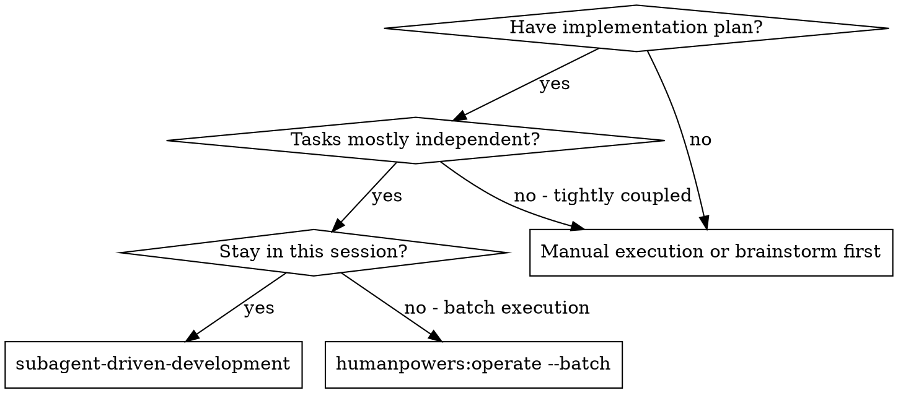
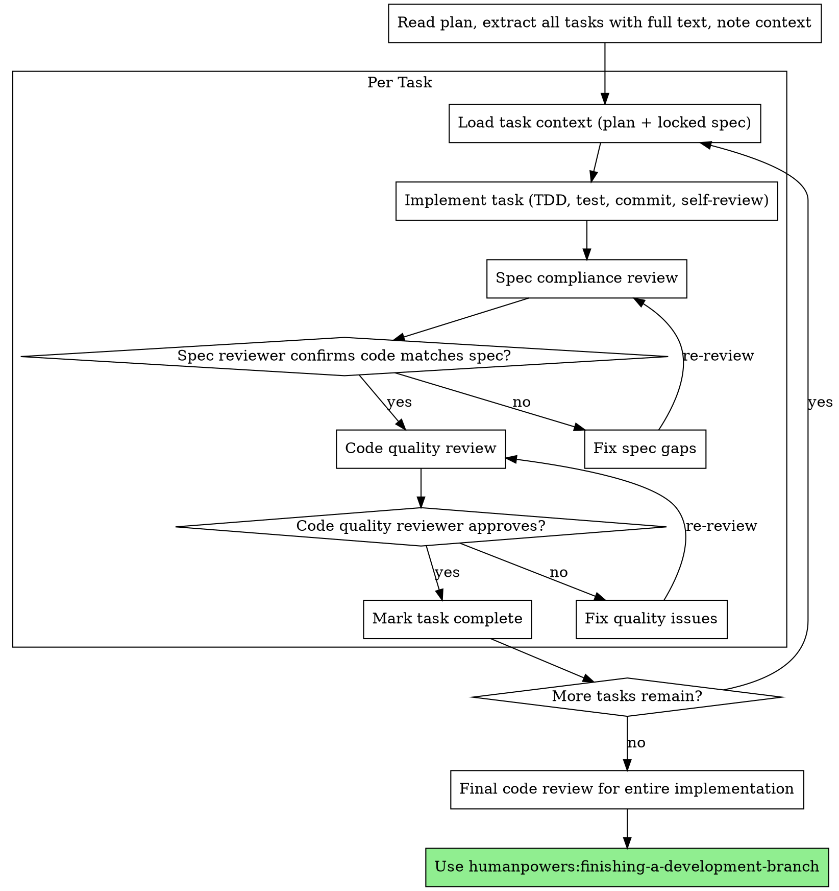

# Subagent-Driven Development

> **Codex CLI note:** Codex CLI does not support dispatching parallel subagents (no Task() tool or Agent tool). When using this skill in Codex, execute each task sequentially in the same session with explicit context boundaries between tasks. The methodology (fresh context per task, two-stage review, spec compliance then code quality) still applies — execute each role (implementer, spec reviewer, code quality reviewer) as sequential steps rather than subagent dispatches.

Execute plan by working through each task with isolated context, with two-stage review after each: spec compliance review first, then code quality review.

**Why context isolation:** Each task should be worked on with focused context. By loading only what's needed for the current task, you ensure focus and prevent context pollution from previous tasks.

**Core principle:** Fresh context per task + two-stage review (spec then quality) = high quality, fast iteration

## When to Use



**vs. operate --batch (batch execution):**
- Same session (no context switch)
- Fresh context per task (no context pollution)
- Two-stage review after each task: spec compliance first, then code quality
- Faster iteration (no human-in-loop between tasks)

## The Process



## Model Selection

Use the least powerful model that can handle each role to conserve cost and increase speed.

**Mechanical implementation tasks** (isolated functions, clear specs, 1-2 files): use a fast, cheap model. Most implementation tasks are mechanical when the plan is well-specified.

**Integration and judgment tasks** (multi-file coordination, pattern matching, debugging): use a standard model.

**Architecture, design, and review tasks**: use the most capable available model.

**Task complexity signals:**
- Touches 1-2 files with a complete spec -> cheap model
- Touches multiple files with integration concerns -> standard model
- Requires design judgment or broad codebase understanding -> most capable model

## Handling Implementer Status

Each implementation pass reports one of four statuses. Handle each appropriately:

**DONE:** Proceed to spec compliance review.

**DONE_WITH_CONCERNS:** The implementer completed the work but flagged doubts. Read the concerns before proceeding. If the concerns are about correctness or scope, address them before review. If they're observations (e.g., "this file is getting large"), note them and proceed to review.

**NEEDS_CONTEXT:** The implementer needs information that wasn't provided. Provide the missing context and re-run the implementation step.

**BLOCKED:** The implementer cannot complete the task. Assess the blocker:
1. If it's a context problem, provide more context and retry
2. If the task requires more reasoning, approach it with more care
3. If the task is too large, break it into smaller pieces
4. If the plan itself is wrong, escalate to the human

**Never** ignore an escalation or force retry without changes. If stuck, something needs to change.

## Prompt Templates

- `./implementer-prompt.md` - Implementation context template
- `./spec-reviewer-prompt.md` - Spec compliance review template
- `./code-quality-reviewer-prompt.md` - Code quality review template

## Example Workflow

```
You: I'm using Subagent-Driven Development to execute this plan.

[Read plan file once: <workspace>/.humanpowers/tasks/{task-id}/plan.md]
[Extract all 5 tasks with full text and context]

Task 1: Hook installation script

[Load Task 1 context]
[Implement with full task text + context]

Question: "Before I begin - should the hook be installed at user or system level?"

Answer: "User level (~/.config/superpowers/hooks/)"

[Continue implementing...]
  - Implemented install-hook command
  - Added tests, 5/5 passing
  - Self-review: Found I missed --force flag, added it
  - Committed

[Run spec compliance review]
Spec reviewer: Spec compliant - all requirements met, nothing extra

[Run code quality review]
Code reviewer: Strengths: Good test coverage, clean. Issues: None. Approved.

[Mark Task 1 complete]

Task 2: Recovery modes

[Load Task 2 context]
[Implement]
  - Added verify/repair modes
  - 8/8 tests passing
  - Self-review: All good
  - Committed

[Run spec compliance review]
Spec reviewer: Issues:
  - Missing: Progress reporting (spec says "report every 100 items")
  - Extra: Added --json flag (not requested)

[Fix issues]
Removed --json flag, added progress reporting

[Re-run spec compliance review]
Spec reviewer: Spec compliant now

[Run code quality review]
Code reviewer: Strengths: Solid. Issues (Important): Magic number (100)

[Fix]
Extracted PROGRESS_INTERVAL constant

[Re-run code quality review]
Code reviewer: Approved

[Mark Task 2 complete]

...

[After all tasks]
[Run final code review]
Final reviewer: All requirements met, ready to merge

Done!
```

## Advantages

**vs. Manual execution:**
- Follow TDD naturally
- Fresh context per task (no confusion)
- Can ask questions (before AND during work)

**vs. operate --batch:**
- Same session (no handoff)
- Continuous progress (no waiting)
- Review checkpoints automatic

**Efficiency gains:**
- No file reading overhead (controller provides full text)
- Exactly what context is needed per task
- Complete information upfront
- Questions surfaced before work begins (not after)

**Quality gates:**
- Self-review catches issues before handoff
- Two-stage review: spec compliance, then code quality
- Review loops ensure fixes actually work
- Spec compliance prevents over/under-building
- Code quality ensures implementation is well-built

**Cost:**
- More review iterations per task
- More prep work (extracting all tasks upfront)
- Review loops add iterations
- But catches issues early (cheaper than debugging later)

## Red Flags

**Never:**
- Start implementation on main/master branch without explicit user consent
- Skip reviews (spec compliance OR code quality)
- Proceed with unfixed issues
- Work on multiple tasks simultaneously without finishing one first (context pollution)
- Skip reading the plan file (load full text instead)
- Skip scene-setting context (need to understand where task fits)
- Ignore questions (answer before proceeding)
- Accept "close enough" on spec compliance (spec reviewer found issues = not done)
- Skip review loops (reviewer found issues = fix = review again)
- Let self-review replace actual review (both are needed)
- **Start code quality review before spec compliance passes** (wrong order)
- Move to next task while either review has open issues

**If questions arise during implementation:**
- Answer clearly and completely
- Provide additional context if needed
- Don't rush into implementation

**If reviewer finds issues:**
- Fix them
- Review again
- Repeat until approved
- Don't skip the re-review

**If implementation fails:**
- Assess what went wrong
- Don't try to fix manually without understanding the issue (context pollution)

## Integration

**Required workflow skills:**
- **humanpowers:using-git-worktrees** - REQUIRED: Set up isolated workspace before starting
- **humanpowers:writing-plans** - Creates the plan this skill executes
- **humanpowers:requesting-code-review** - Code review template for review steps
- **humanpowers:finishing-a-development-branch** - Complete development after all tasks

**Implementation should use:**
- **humanpowers:test-driven-development** - Follow TDD for each task

**Alternative workflow:**
- **humanpowers:operate --batch** - Use for batch execution instead of same-session execution

## humanpowers Task Lead Pattern

In humanpowers, each task is worked on with the role of task lead — ad-hoc per task, no fixed domain identity.

**Before implementing or reviewing any task**, load the locked behavioral contract:

```bash
bash scripts/parse-answers.sh {task-id} "$WS"
```

Inject this output into the implementation context as `## Locked Behavior Spec`. Do NOT read round1.md directly during implementation.

**Context convention**:
- `## Locked Behavior Spec` = parse-answers.sh output (behavioral contract)
- `## Implementation Plan` = plan.md full text (implementation guide)
- Work within scope of that task only
- Same human/agent can lead different tasks (no role attachment)
- `round1.md` answers take precedence over plan.md interpretation when they conflict
